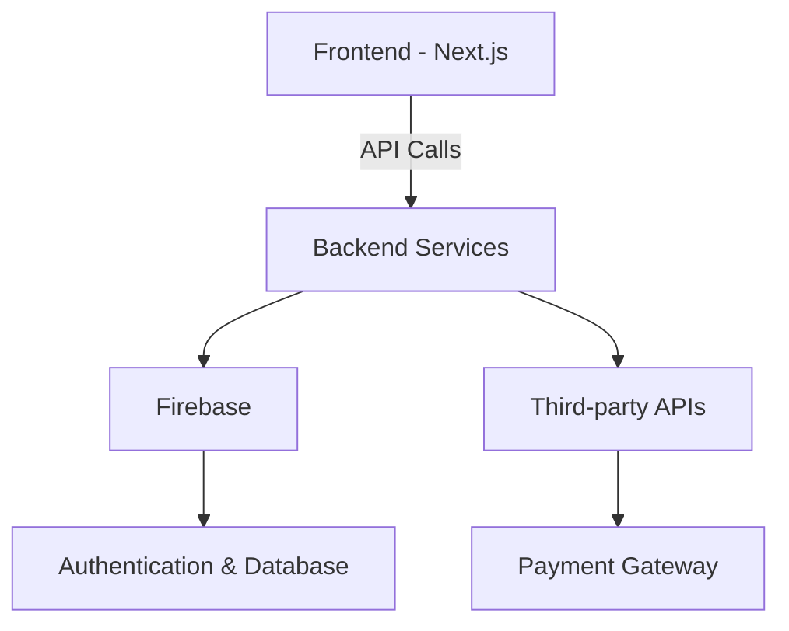

# Alpha Code Webapp

## Description
Alpha Code Webapp is a modern, scalable, and feature-rich web application built using Next.js. Designed to streamline educational workflows, it provides tools for managing courses, users, and subscriptions, while integrating advanced features like chatbots, block coding, and more.

---

## Introduction
Welcome to the Alpha Code Webapp! This project is a comprehensive solution for educational institutions and developers looking to create interactive and engaging learning platforms. Leveraging the power of Next.js, Tailwind CSS, and Firebase, this application ensures high performance, scalability, and ease of use.

---

## Key Features
- **User Management**: Role-based access control for admins, staff, parents, and students.
- **Course Management**: Create, manage, and enroll in courses with ease.
- **Interactive Learning**: Includes block coding, chatbots, and magic sketch tools.
- **Subscription Plans**: Flexible subscription management for users.
- **Real-time Notifications**: Stay updated with Firebase-powered notifications.
- **Responsive Design**: Optimized for both desktop and mobile devices.

---

## Overall Architecture

The architecture is modular, with a Next.js frontend communicating with Firebase and other backend services for data management, authentication, and integrations.

---

## Installation
1. Clone the repository:
   ```bash
   git clone https://github.com/your-repo/alpha-code-webapp.git
   ```
2. Navigate to the project directory:
   ```bash
   cd alpha-code-webapp
   ```
3. Install dependencies:
   ```bash
   yarn install
   ```

---

## Running the Project
To start the development server:
```bash
yarn dev
```
Visit [http://localhost:3000](http://localhost:3000) to view the application.

---

## Environment Configuration
Create a `.env.local` file in the root directory and add the following variables:
```env
NEXT_PUBLIC_FIREBASE_API_KEY=your_firebase_api_key
NEXT_PUBLIC_FIREBASE_AUTH_DOMAIN=your_firebase_auth_domain
NEXT_PUBLIC_FIREBASE_PROJECT_ID=your_firebase_project_id
NEXT_PUBLIC_FIREBASE_STORAGE_BUCKET=your_firebase_storage_bucket
NEXT_PUBLIC_FIREBASE_MESSAGING_SENDER_ID=your_firebase_messaging_sender_id
NEXT_PUBLIC_FIREBASE_APP_ID=your_firebase_app_id
```

---

## Folder Structure
```plaintext
alpha-code-webapp/
├── public/               # Static assets
├── src/
│   ├── app/             # Next.js app directory
│   ├── components/      # Reusable components
│   ├── config/          # Configuration files
│   ├── features/        # Feature-specific modules
│   ├── hooks/           # Custom React hooks
│   ├── lib/             # Utility functions
│   ├── services/        # API services
│   ├── store/           # Redux store slices
│   ├── types/           # TypeScript types
│   └── utils/           # Helper utilities
└── ...
```

---

## Contribution Guidelines
We welcome contributions! To get started:
1. Fork the repository.
2. Create a new branch for your feature:
   ```bash
   git checkout -b feature-name
   ```
3. Commit your changes:
   ```bash
   git commit -m "Add new feature"
   ```
4. Push to your branch:
   ```bash
   git push origin feature-name
   ```
5. Open a pull request.

---

## License
This project is licensed under the MIT License. See the `LICENSE` file for details.

---

## Roadmap
- [ ] Add support for additional payment gateways.
- [ ] Implement AI-powered course recommendations.
- [ ] Enhance accessibility features.
- [ ] Expand documentation with more examples and tutorials.
